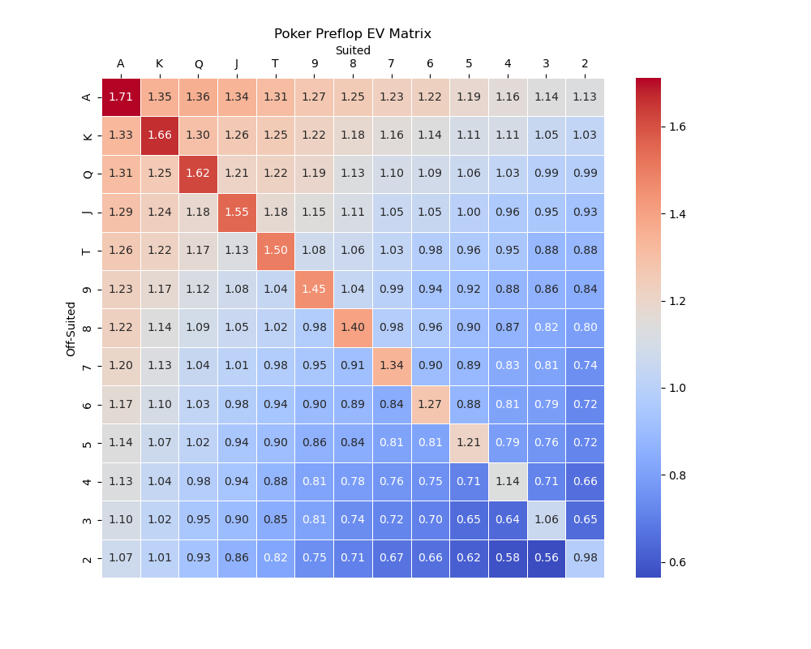

# Poker Machine Learning README

Welcome to the Poker Machine Learning project repository! This advanced machine learning endeavor is tailored to unearth optimal strategies for playing heads-up (one-on-one) poker, focusing on Texas Hold'em – the most popular variation of poker. This project has been meticulously crafted to bridge the gap between theoretical machine learning algorithms and their practical application in game theory and decision-making under uncertainty.

## Project Overview

The aim of the project is to develop a robust AI poker player capable of competing against human players and other AI contestants. Through a combination of hand-crafted feature extraction, state-of-the-art machine learning models, and rigorous training/testing procedures, this project delves into the complex and intriguing world of poker strategy.

The repository is organized into several vital components:

- `Models/`: Contains the trained machine learning models.
- `Player/`: Houses the bot logic and decision-making algorithms.
- `Utils/`: Includes various utilities for data processing and analytics.
- `Game_setup.py`: Configuration and setup script for initializing game parameters.

## Features

- **Advanced Feature Extraction**: A sophisticated system for processing the game state, distilling vital information such as normalized stack sizes, hole card strengths, and pot sizes to inform AI decisions.
- **Machine Learning Integration**: Machine learning models developed with PyTorch are integrated to determine the best course of action given the current game situation.
- **Optimized Strategy**: Through rigorous training, the AI players adjust their strategies to maximize expected value and adopt the most effective tactics against a wide range of opponents.
- **Simulated Testing Environment**: Comprehensive testing frameworks to evaluate AI performance against various playstyles and scenarios.
  
## Models Documentation

The machine learning models are the core of this project. They have been trained on exhaustive datasets that encapsulate numerous poker scenarios and strategic considerations, thus encapsulating the essence of human-like intuition and decision-making in a poker game.

## Getting Started

Refer to `game_setup.py` for basic configurations to set up the initial game parameters.

# Basic Pre-Flop Poker Strategy Guide

Welcome to our Basic Pre-Flop Poker Strategy Guide! This guide is designed to help you make more informed decisions during the crucial pre-flop phase of poker games. Understanding and implementing a solid pre-flop strategy is essential for laying the groundwork for successful play in the subsequent rounds.

## Understanding Pre-Flop

Pre-flop refers to the stage in a round of poker that occurs after each player has been dealt their hole cards (the two private cards dealt to each player) but before the flop (the first three community cards) is revealed. Decisions made during this stage can significantly influence the outcome of the hand.

## Objectives

1. **Hand Selection**: Learn how to recognize strong starting hands.
2. **Position Awareness**: Understand how your position at the table should influence your actions.
3. **Bet Sizing**: Identify appropriate bet sizes to accomplish your goals.
4. **Player Adaptation**: Adjust your strategy based on the tendencies of your opponents.

## Hand Selection Chart

The following chart provides a simplified guide to which hands you should consider playing based on your position. Note that `X` denotes a card of any rank.

| Position      | Hands to Play                                            |
|---------------|----------------------------------------------------------|
| Early Position (UTG, UTG+1) | AA, KK, QQ, JJ, TT, 99, AKs, AQs, AKo                     |
| Middle Position         | Add 88, 77, AQo, AJs, KQs to the above                    |
| Late Position (Hijack, Cutoff, Button) | Add any pair, ATs, ATo, KJs, QJs, JTs, T9s, 98s, 87s to the above |

- `s` denotes suited cards (same suit).
- `o` denotes offsuit cards (different suits).

## Position Awareness

- **Early Position**: Playing conservatively is key. Stick to the strongest hands.
- **Middle Position**: You can start to play a bit more loosely but remain cautious.
- **Late Position**: The most advantageous position. You can play the widest range of hands and take more calculated risks.

## Bet Sizing

- **Opening Raises**: 2.5x to 3x the big blind is standard. Adjust based on table dynamics.
- **3-Bets**: Typically, 3x the original raise. Consider the original raiser's position and stack size.

## Player Adaptation

- **Tight Players**: Exploit by bluffing more often, especially if they show reluctance to enter pots.
- **Loose Players**: Value bet your strong hands more frequently. They're likely to call with inferior hands.

## Conclusion

This guide provides a foundation for your pre-flop strategy, but remember, flexibility is key to a successful poker strategy. Adjust your play style based on the game's dynamics and your opponents' tendencies. Good luck, and may your folds be few and your pots be plentiful!

*Note: The included strategy is a starting point and should be adapted based on your experience and the specific context of each game.*

## Contributions

This project welcomes contributions from the community! Whether it's improving the models, refining feature extraction techniques, or proposing entirely new algorithms – your insights can be a catalyst for progress.

## Further Work

The field of AI in poker is continuously evolving. Future directions of this project may include the implementation of reinforcement learning techniques, analysis of multi-player scenarios, and real-time adaptation algorithms.

## Authors

- **Trevor Poon** - _Initial work_

## Acknowledgments

A heartfelt thank you to the AI research community, whose open-source contributions and insightful research papers have been the guiding light for this project.

---

For any inquiries or suggestions, please open an issue in this repository or reach out directly. We hope you find this work both insightful and inspiring as you embark on your AI journey in the realm of strategic gaming! Enjoy the challenge, and may the odds be in your favor.